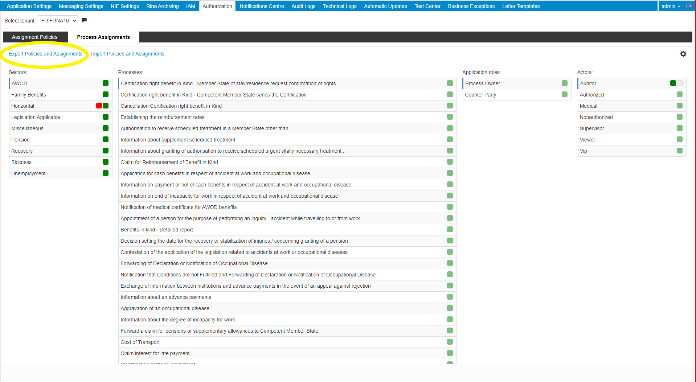
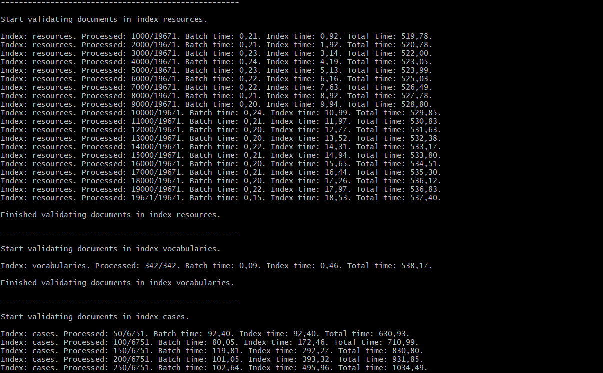
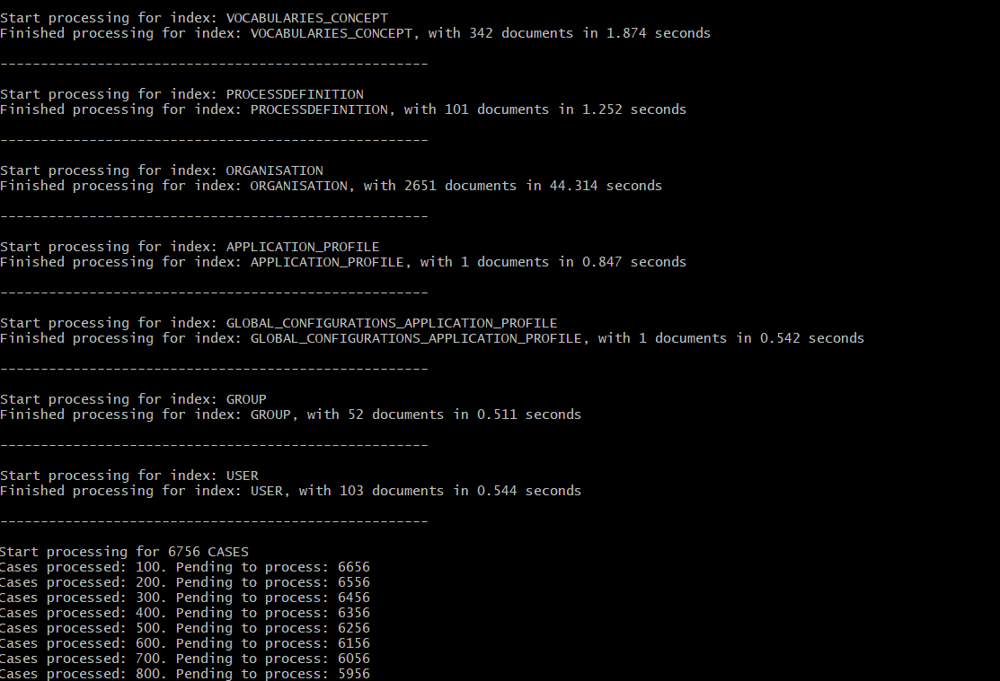

# Data Migration tool
This document describes how to use the Data Migration tool that validates Elasticsearch documents and imports them into an SQL database. The aim of this tool is to migrate data from Elasticsearch 5.6.x to Postgresql 12 and it can be used for validating and importing documents produced by RINA versions 5.6.x. The Data Migration tool is a Spring Boot application, and requires Java 11.

## Before running
To Data Migration tool is delivered as a zip containing a jar and a folder named `config` with configuration files.

The structure of the project is like this:

```
.
└── deploy_folder                   # the folder where the zip content is extracted
    ├── EESSI-RINA-DATA-MIGRATION-x.y.z.jar # the data Migration tool jar
    ├── ChangeLog.txt               # the change log file
    ├── config                      # config folder
    │   ├── bucs                    # folder containing the buc definitions
    │   ├── field_mapping           # folder containing Elasticsearch-SQL field mappings
    │   ├── jpa                     # folder containing SQL connection properties
    │   ├── sql                     # folder containing SQL pre-population scripts
    │   ├── application.properties  # properties configurations
    │   └── log4j2.xml              # logging configurations
    └── scripts                     # scripts folder
        └── bonita-actors-extractor # script for extracting the actor roles mapping from Bonita DB
            ├── sql                 # folder containing the sql scripts used by the extractor
            ├── actors_extractor.ps1 # the Windows version of the extractor script
            └── actors_extractor.sh # the Linux version of the extractor script
```

Before running the Data Migration tool, there are some properties that have to be configured in the [application.properties](../application/src/main/resources/application.properties) (e.g. specify how to connect to Elasticsearch, or Postgresq, provide paths to different resources). The `application.properties` comes preconfigured as below: 

``` 
# Elasticsearch configuration
 elasticsearch.host=pl01-frna10.westeurope.cloudapp.azure.com
 elasticsearch.port=9200
# SQL configuration
 rina.configuration.datasource=./config/
 sql.scripts.path=./config/sql
# Elasticsearch-SQL field mappings
 schema.path=./config/field_mappings
# Path to the buc definitions
 buc.definitions.path=./config/bucs
# Exported policy assignment from RINA
 policy.assignments.export.file=./config/ProcessDefinitionAssignments.json
# Logging
 logging.config=./config/log4j2.xml
# Output
 reporting.folder=./output
# Misc
 spring.banner.location=classpath:/banner.txt
```  

**Configuration:** 

Most of the properties defined in `application.properties` are already preconfigured. They don't need to be changed in order for the Data Migration tool to run. There are, however, three things that need to be configured before running the tool:
1. the connection to Elasticsearch
   - property in `application.properties`: `elasticsearch.host`
   - property in `application.properties`: `elasticsearch.port`
2. the connection to PotgreSQL
   - relevant properties from `config/jpa/db.properties`
   - relevant properties from `config/jpa/jpa.properties`
3. the path to the policy assignments json file
   - property in `application.properties`: `policy.assignments.export.file`

The full list of properties that can be configured in the `application.properties` can be found below:

* `elasticsearch.host`: the host of the Elasticsearch node (it does not matter if Elasticsearch is clustered, a connection to any active node will suffice)
* `elasticsearch.port`: the port of the Elasticsearch node
* `rina.configuration.datasource`: the path to the folder that contains the `jpa` subfolder. This is preconfigured to `config`. The `jpa` folder contains the SQL connection properties files, and is structured like this:

    ```
    .
    └── config                  # config folder
        └── jpa                 # folder containing SQL connection properties
            ├── db.properties   # Postgresql datasource properties
            └── jpa.properties  # Hibernate properties
    ```
  
* `sql.scripts.path`: the path to the SQL pre-population scripts. This is preconfigured to `config/sql`.
* `schema.path`: the path to the Elasticsearch-SQL field mappings. This is preconfigured to `config/field_mappings`. 
* `buc.definitions.path`: the path to the BUC definitions. This is preconfigured to `config/bucs`. 
* `policy.assignments.export.file`: the path to the exported policy assignments json file (see how to get this file below).

    ####How to export ProcessDefinitionsAssignments.json with RINA 5.6?
    1. Go into the RINA portal
    2. Log in with the ****admin**** account
    3. Go to `Authorization`
    4. Go to `Process Assignments`
    5. Click on `Export Policies And Assignments`, as shown below:
                
    6. Save the json file in the `config` folder
    
* `logging.config`: the path to the `log4j2.xml` configuration file. It is recommended to use the pre-configured [log4j2.xml](../application/src/main/resources/log4j2.xml) provided in the `config` folder.
* `reporting.folder`: the output folder where the validator and importer reports will be saved; this will be automatically created if it does not exist. The next structure will be created when executing the Data Migration tool:

    ```
    └── output                          # specified reports folder
        ├── validator                   # validator output folder
        └── importer                    # importer output folder
    ``` 

## Execution

The Data migration tool can be run with the following command:
```
java -jar EESSI-RINA-DATA-MIGRATION-x.y.z.jar [params]
``` 

There are different options to run the Data Migration tool:

   * Validate all resources from Elasticsearch (default execution)
   * Validate all resources associated to a specific case from Elasticsearch
   * Import all resources from Elasticsearch to PostgreSQL
   * Import all resources associated to a specific case from Elasticsearch to PostgreSQL
   * Validate all resources and, if there are no validation errors, then also import all resources from Elasticsearch to PostgreSQL 
  
##### Validate all resources from Elasticsearch

```
java -jar EESSI-RINA-DATA-MIGRATION-x.y.z.jar -validate-all
```

This is the default execution in case there are not any `params`.
  
##### Validate all resources associated to a specific case from Elasticsearch

```
java -jar EESSI-RINA-DATA-MIGRATION-x.y.z.jar -validate-case <local_case_id>
```

Example: `java -jar EESSI-RINA-DATA-MIGRATION-x.y.z.jar -validate-case 23415`

##### Import all resources from Elasticsearch to PostgreSQL

```
java -jar EESSI-RINA-DATA-MIGRATION-x.y.z.jar -import-all
```

##### Import all resources associated to a specific case from Elasticsearch to PostgreSQL

```
java -jar EESSI-RINA-DATA-MIGRATION-x.y.z.jar -import-case <local_case_id>
```

Example: `java -jar EESSI-RINA-DATA-MIGRATION-x.y.z.jar -import-case 23415`

##### Validate all resources and then import all resources from Elasticsearch to PostgreSQL

```
java -jar EESSI-RINA-DATA-MIGRATION-x.y.z.jar -validate-import
```

## Output

While running the Data Migration tool, the application will write to console various information.

At the same time, based on the log configuration from the default provided [log4j2.xml](../application/src/main/resources/log4j2.xml), a folder named `logs` will be automatically generated in the execution folder, containing an `app.log` file with info about the application execution and the documents processed.

At this point, we can differentiate between the output of a **validation** or an **import** process.

###Validation

####Console

In the case of running a `Validation`, the tool will write to the console various information such as the index that is being processed, number of documents, and other stats. The validation process should end with a line like this: `Total processing time: [...]`.

Console output example:


####Report files

At the same time, besides the previously mentioned `app.log` file, the validation process is generating a set of reports containing validation results on different levels. These reports aggregate information on what types of documents were processed, how many, and a summary of the validation issues found (this last part may be missing if no errors are found). The report files are formatted as jsons.

Currently, there are two types of reports:
 * an aggregated overview report at the index level
 * a more detailed report at the case level
 
 For each index that is being processed, the validator tool creates an aggregated overview report which is saved as `<index_name>.json` in the reporting folder (defined in the property `reporting.folder`). If validation errors are found when processing case resources, another set of reports is created in a subfolder of the reporting folder named `cases`. These are more detailed reports and are aggregated at the case level, meaning that all the validation errors found in any of the resources belonging to a case will be saved in the same file, which is named `case_<caseId>.json`. The subfolder `cases` may be completely missing if no validation errors are found in any of the cases.
 
 As an example, structure of the output folder may look like this:
 ```
.
└── validator                   # the reporting folder
    ├── admin.json              # report for index admin
    ├── entities.json           # report for index entities
    ├── identity.json           # report for index identity
    ├── [...]                   # other reports
    └── cases                   # folder containing detailed case reports
        ├── case_1111.json      # aggregated report for case 1111 
        └── case_2222.json      # aggregated report for case 2222
 ```

The preconfigured [logger](../application/src/main/resources/log4j2.xml) uses a `FileAppender` with log rotation, and the log level is set to `INFO`. Note that changing this to `DEBUG` may create a large quantity of logs (the number of files or their size may need to be increased to store all log information).

###Import

####Console
In the case of running an `Import`, the tool will write to the console various information such as the index that is being processed, number of documents and time spent.

Console output example:


####Report files

At the same time, besides the previously mentioned `app.log` file, the import process is generating a set of reports containing the import results. These reports are stored in the output folder, in a subfolder named `import`.
